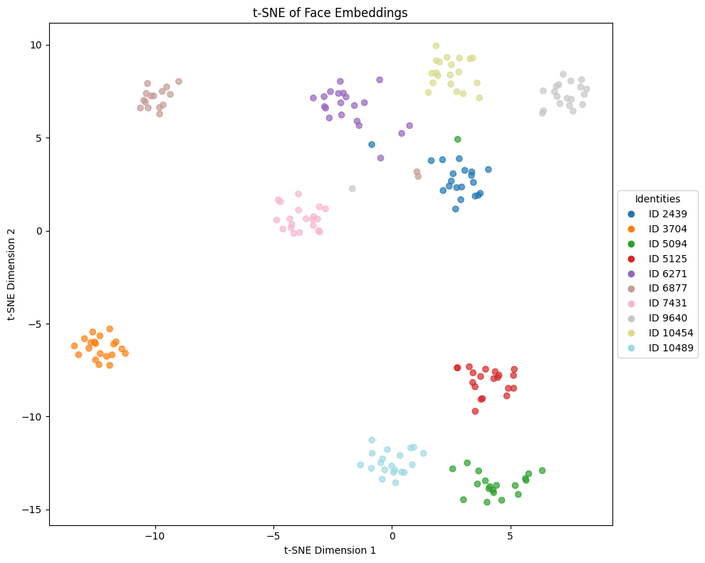
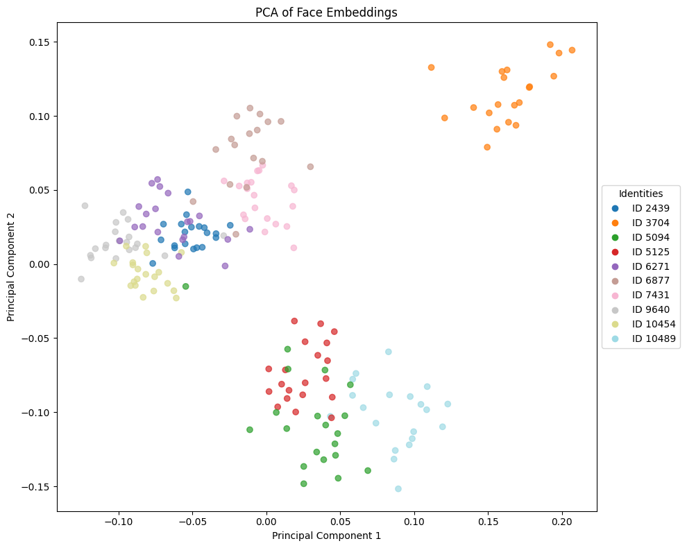

# Metric Learning for Face Recognition
- **Group ID**: G25
- **Project ID**: 1

---

## 1. Introduction and Objective
Il riconoscimento facciale rappresenta una sfida complessa in computer vision, specialmente per l'identificazione di soggetti con ampie variazioni di illuminazione, posa o espressione. L'obiettivo principale di questo progetto è implementare e valutare architetture di **Metric Learning** capaci di generalizzare su volti e identità mai viste durante l'addestramento. Per farlo, ho costruito una pipeline flessibile progettata per estrarre embedding distintivi, misurandone poi le validità tramite un task di Retrieval su un set con identità mutuamente esclusive.

## 2. Contribution and Added Value
Ho costruito un sistema di face recognition basato su **ResNet-18** per apprendere embedding capaci di generalizzare su identità non viste. Rispetto a un classico baseline classificativo, il contributo principale è una pipeline di metric learning pensata per migliorare retrieval e clustering nello spazio latente.

Il valore aggiunto rispetto al semplice riuso di codice esistente è dato da:
- **Triplet Loss con online mining**: una implementazione custom con strategie hard e semi-hard, e un confronto diretto tra formulazione hinge e formulazione soft.
- **PK sampling**: una strategia di costruzione dei batch che raggruppa $P$ identità e $K$ immagini per identità, rendendo il mining più efficace e stabile.
- **Progettazione dell'embedding**: una projection head da 512 dimensioni con normalizzazione L2, utile a migliorare la geometria dello spazio per il retrieval coseno.
- **Workflow di valutazione**: una pipeline riproducibile per training e retrieval, usata per confrontare il baseline con le varianti metric learning.

## 3. Data Used
Il dataset utilizzato è il **CASIA-WebFace**, per un totale empirico di circa ~490.000 face crops indicizzanti ~10.000 identità uniche. I file MXNet originari (`.rec` e `.idx`) sono stati decodificati localmente ed organizzati.
- **Data Splitting Disgiunto**: Quale vincolo logico strutturale è stata creata una gerarchia di test e train con *information leakage nullo*; il validation set contiene solo istanze umane differenti e non sovrapponibili al training data.
- **Rumorosità (Noise) Intrinseca del Dataset**: Va tuttavia sottolineato un fattore vitale nell'utilizzo di CASIA-WebFace. Così come studiato scientificamente nel paper *Anti-noise*, un grave limite di quest'ultimo è l'alta percentuale di target rumorosi. Fino al **9.3% - 13%** del dataset analizzato contiene rumore o etichette errate, fra le quali un **7.7%** stimato di effettivo **mislabeling** annotato manualmente. Tale problematica genera pesanti impatti negli update gradienti con strategie di Hard Mining spinto (avvelenando il segnale d'addestramento e collassando occasionalmente l'architettura).

## 4. Methodology and Architecture
L'apparato si basa sul backbone image-classifier **ResNet-18**. È stato eliso l'ultimo stadio FC a vantaggio di una custom head di proiezione, destinata alla composizione di un L2-normalized embedding a 512 dimensioni (cruciale sia per logiche di retrieval coseno, sia per i constraint preposti dall'uso di ArcFace).

- **Baseline**: Training puro di rete supervisionata categorica in multi-class entropico ordinario, validato ex-post ai fini di retrieval puro.
- **Triplet Loss Module**: Sfruttando un campionamento guidato PK, sono state calcolate matrici batch-wise di euclidean e cosine distance al fine di selezionare positivi e negativi difficili (*hard mining*). La differenza davvero rilevante nelle prove è stata la formulazione della loss: variante *hinge* con margine esplicito versus variante *soft* basata su `softplus`, che non usa un margine numerico fisso.
- **Sub-center ArcFace**: Implementazione extra introdotta a valle della validazione di metriche classiche. Modula i vettori e amplifica i volumi separabili tramite i penalty scalari angolari.

## 5. Results and Discussion
I log di training su cluster e il testing metrico certificano in maniera lampante il vantaggio logico delle feature estratte via constringimento vettoriale rispetto al training classificativo di base.

**Tabella 1**: Valutazioni di Retrieval (mAP Index)

| Model Variante | Tuning Chiave | mAP@1 | mAP@5 | mAP@10 |
| :--- | :--- | :---: | :---: | :---: |
| **Baseline** (100 Epoche) | Classificazione Standard | ~52.1% | ~40.3% | ~34.2% |
| **Triplet Loss** | Softmargin, Hard-mining, PK(32,4) |  ~87.0% | ~81.0% | ~77.0% |
| **ArcFace** (30 Epoche) | - | ~82.1% | ~74.6% | ~69.0% |

**Discussione**: 
Il punto decisivo non è il valore del *margin* in sé, ma la formulazione della triplet loss e la strategia di mining. La versione *hinge* introduce un margine esplicito e, quando combinata con hard mining, può diventare molto sensibile al label noise e far collassare il modello, perché spinge con forza i casi più difficili, inclusi quelli potenzialmente rumorosi. La versione *soft*, invece, usa una penalizzazione continua tramite `softplus` sul gap tra hard positive e hard negative e non dipende da un parametro numerico di margine; per questo è più corretto descriverla come una loss più morbida e stabile, non come un `softmargin` a 0.1. In questo setting il modello triplet raggiunge comunque circa **~87% mAP@1**, restando competitivo rispetto alla branch **ArcFace** (~82%).

### 5.1 Analisi dello Spazio Latente (Cluster Analysis)
Applicando metodi di riduzione della dimensionalità vettoriale, verifichiamo la disposizione intra-classe. Si osserva visibilmente come i metodi contrastivi riescano ad organizzare nuvole sferiche ad alta coesione identitaria.

*Figura: t-SNE degli embedding facciali (file: figures/tsne_triplet.png).* 

*Figura: PCA degli embedding facciali (file: figures/pca_triplet.png).* 

### 5.2 Ablation Study
Per isolare l'effetto delle principali scelte progettuali, sono stati confrontati alcuni run con variazioni su sampler, dimensione dell'embedding, tipo di loss e strategia di mining.

**Tabella 2**: Ablation sui run triplet

| Run Date | Sampler | Embedding | Loss | Mining | mAP@1 | mAP@5 | mAP@10 |
| :--- | :--- | :---: | :--- | :--- | :---: | :---: | :---: |
| 2026-05-13 | PK(24, 4) | 128 | Softmargin | easy to hard | .70 | .60 | .54 |
| 2026-05-14 | PK(24, 4) | 512 | Softmargin | easy to hard | .69 | .58 | .51 |
| 2026-05-14 | PK(24, 4) | 512 | Softmargin | easy | .68 | .57 | .50 |
| 2026-05-14 | PK(32, 4) | 512 | Softmargin | easy to semi | .72 | .62 | .56 |
| 2026-05-15 | PK(32, 4) | 512 | Softmargin | hard | .86 | .80 | .75 |
| 2026-05-15 | PK(32, 4) | 512 | Softmargin | semi to hard | .82 | .74 | .69 |
| 2026-05-15 | PK(32, 4) | 512 | Softmargin | hard | .87 | .81 | .77 |
| 2026-05-16 | PK(42, 4) | 512 | Softmargin | hard | .86 | .80 | .75 |
| 2026-05-15 | PK(32, 4) | 512 | Hingemargin | hard | .25 | .16 | .12 |

I risultati mostrano tre segnali principali. Primo: la combinazione di hard mining con la loss soft ha prodotto i valori migliori, mentre la variante hinge con hard mining degrada in modo netto. Secondo: il salto di qualità non dipende da un singolo parametro isolato, ma dall’interazione tra sampler PK, strategia di mining e formulazione della loss; in particolare, configurazioni con batch effettivo più piccolo di 32×4 hanno mostrato maggiore tendenza all’overfitting. Terzo: la configurazione con PK(32,4), embedding da 512 e loss soft rappresenta il compromesso più solido del ciclo sperimentale, con un leggero vantaggio quando la normalizzazione viene applicata solo nella loss e non direttamente agli embedding del modello, portando le prestazioni circa da 86% a 87%.

## 6. Conclusion and Limitations
Nel complesso, i framework metrici implementati mostrano che un addestramento orientato alle omogeneità latenti produce un miglioramento consistente nella validazione zero-shot, pari a circa +35% di mAP@1 rispetto al baseline.  
Per quanto riguarda le limitazioni, emergono due aspetti principali da considerare per gli sviluppi futuri:
- **Mislabeling**: Aumentando la sensibilità dei modelli agli *Hard Negative*, si corre costantemente il rischio di istruire un loop distruttivo per colpa dei sample deviati del CASIA-WebFace. Per il futuro andrebbero esplorate dinamiche di pulizia semi-supervisionata, detection o approcci come l'utilizzo intrinseco del multiple sub-center ArcFace mirato a isolare esplicitamente le variazioni noise-related.
- **Assenza di Face Alignment Frameworks**: Tali modelli ingoiano e si abissano nei pesanti cambiamenti di tracking dei lineamenti. Data la topologia limitata del tempo sperimentale non è stato implementato nessun rilevatore/allineatore preventivo di punti di interesse (come **MTCNN**). L'aggiunta di un layer preparatorio di cropping allineato sui landmark fisiognomici prima della feed-forward phase alzerebbe drasticamente la ceiling capacity della pipeline.

## 7. Additional Information

### 7.1 Use of Artificial Intelligence
Nella realizzazione del template del sistema e dei log d'esecuzione locale, l'uso di AI è stato limitato al supporto per sintassi di routine, bug fixing e interazione operativa con il cluster durante l'esecuzione e il monitoraggio dei training run. Le scelte di architettura, tuning e valutazione sono state invece prese in modo informato dal sottoscritto, a partire dallo studio diretto della letteratura di riferimento.

### 7.2 Reference Papers
Le scelte metodologiche principali sono state guidate dalla lettura dei materiali raccolti in `docs/papers`:

- _FaceNet: A Unified Embedding for Face Recognition and Clustering_
- _ArcFace: Additive Angular Margin Loss for Deep Face Recognition_
- _Hard-Mining Loss based Convolutional Neural Network for Face Recognition_
- _Anti-Noise Face: A Resilient Model for Face Recognition with Labled Noise Data_
- _In Defense of the Triplet Loss for Person Re-Identification_
