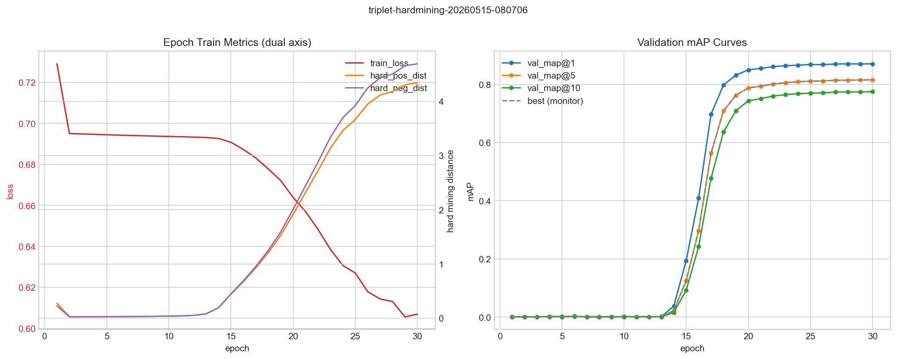
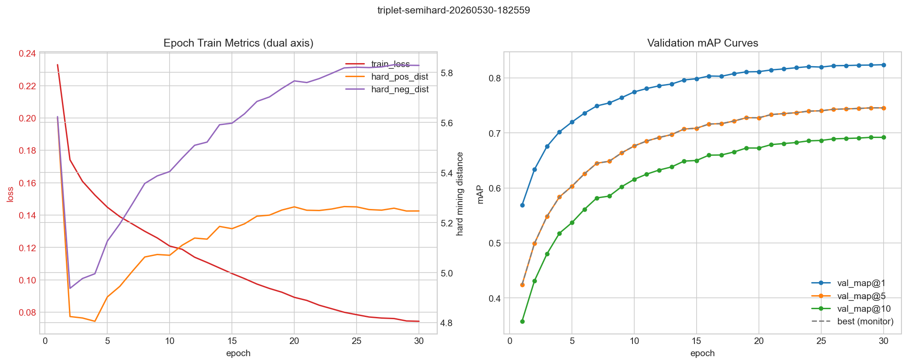
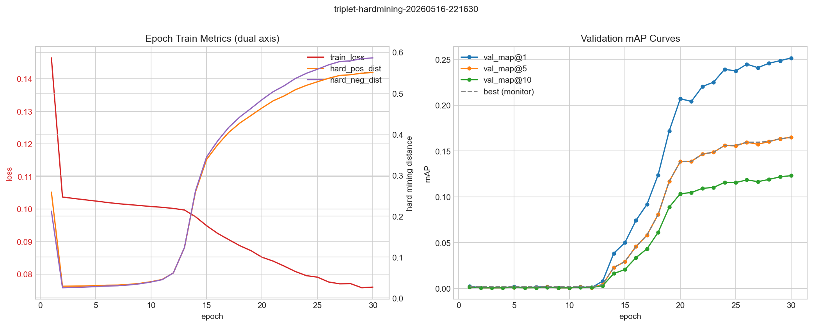

# Metric Learning for Face Recognition

- **Group ID**: G25
- **Project ID**: 1

---

## 1. Introduction and Objective

Il riconoscimento facciale rappresenta una sfida complessa in computer vision, specialmente per l'identificazione di soggetti con ampie variazioni di illuminazione, posa o espressione. L'obiettivo principale di questo progetto è implementare e valutare architetture di **Metric Learning** capaci di generalizzare su volti e identità mai viste durante l'addestramento. Per farlo, ho costruito una pipeline flessibile progettata per estrarre embedding distintivi, misurandone la qualità tramite un task di Retrieval su un set con identità mutuamente esclusive.

## 2. Contribution and Added Value

Ho costruito un sistema di face recognition basato su **ResNet-18** per apprendere embedding capaci di generalizzare su identità non viste. Rispetto a un classico baseline classificativo, il contributo principale è una pipeline di metric learning pensata per migliorare retrieval e clustering nello spazio latente.

Il valore aggiunto rispetto al semplice riuso di codice esistente è dato da:

- **Triplet Loss con online mining**: una implementazione custom con strategie hard e semi-hard, e un confronto diretto tra formulazione hinge e formulazione soft.
- **PK sampling**: una strategia di costruzione dei batch che raggruppa $P$ identità e $K$ immagini per identità, rendendo il mining più efficace e stabile.
- **Progettazione dell'embedding**: uno strato lineare di proiezione a 512 dimensioni con normalizzazione L2, utile a migliorare la geometria dello spazio per il retrieval coseno.
- **Workflow di valutazione**: una pipeline riproducibile per training e retrieval, usata per confrontare il baseline con le varianti metric learning.

## 3. Data Used

Il dataset utilizzato è il **CASIA-WebFace**, per un totale di ~490.000 face crops indicizzanti ~10.000 identità uniche. I file MXNet originari (`.rec` e `.idx`) sono stati decodificati localmente ed organizzati.

- **Data Splitting Disgiunto**: Quale vincolo logico strutturale è stata creata una gerarchia di test e train con *information leakage nullo*; il validation set contiene solo istanze umane differenti e non sovrapponibili al training data.
- **Rumorosità (Noise) Intrinseca del Dataset**: Va tuttavia sottolineato un fattore vitale nell'utilizzo di CASIA-WebFace. Così come studiato scientificamente nel paper *Anti-noise*, un grave limite di quest'ultimo è l'alta percentuale di target rumorosi. Fino al **9.3% - 13%** del dataset analizzato contiene rumore o etichette errate, fra le quali un **7.7%** stimato di effettivo **mislabeling** annotato manualmente. Tale problematica genera pesanti impatti negli update gradienti con strategie di Hard Mining spinto (avvelenando il segnale d'addestramento e collassando occasionalmente l'architettura).

## 4. Methodology and Architecture

L'apparato si basa sul backbone image-classifier **ResNet-18**. È stato rimosso il layer fully-connected finale a vantaggio di uno strato lineare di proiezione, che produce un embedding L2-normalizzato a 512 dimensioni (cruciale sia per il retrieval coseno sia per i vincoli imposti dall'uso di ArcFace).

- **Baseline**: Training puro di rete supervisionata categorica in multi-class entropico ordinario, validato ex-post ai fini di retrieval puro.
- **Triplet Loss Module**: Sfruttando un campionamento guidato PK, sono state calcolate matrici batch-wise di euclidean e cosine distance al fine di selezionare positivi e negativi difficili (*hard mining*). La differenza davvero rilevante nelle prove è stata la formulazione della loss: variante *hinge* con margine esplicito versus variante *soft* basata su `softplus`, che non usa un margine numerico fisso.
- **Sub-center ArcFace**: Implementazione extra introdotta a valle della validazione di metriche classiche. Introduce un margine angolare additivo nello spazio coseno, incrementando la separabilità inter-classe.

## 5. Results and Discussion

I log di training su cluster e la valutazione metrica confermano il vantaggio delle feature estratte via metric learning rispetto al training classificativo di base.

**Tabella 1**: Valutazioni di Retrieval (mAP Index)

| Modello | Caratteristiche principali | mAP@1 | mAP@5 | mAP@10 |
| :--- | :--- | :---: | :---: | :---: |
| **Baseline** | Classificazione Standard | ~63.0% | ~50.7% | ~44.1% |
| **Triplet (Naive)** | Hingemargin ($m=0.2$), Semi-hard, PK(32,4) | ~78.0% | ~69.0% | ~64.0% |
| **Triplet (Engineered)** | Softmargin, Hard-mining, PK(32,4) | **~87.0%** | **~81.0%** | **~77.0%** |
| **ArcFace (Naive)** | Sub-center ($k=3$), $s=64.0$, $m=0.5$ | ~83.9% | ~77.1% | ~71.8% |

**Discussione**:
Il confronto evidenzia l'impatto critico delle scelte di modellazione nel contrasto al label noise intrinseco del dataset. 
Innanzitutto, confrontando le due versioni di Triplet Loss, la variante **Triplet (Naive)** (basata sulla formulazione hinge standard con semi-hard mining) si ferma a **~78.0% mAP@1**. Al contrario, la versione **Triplet (Engineered)**, che sfrutta la loss softmargin e l'online hard mining combinati con la normalizzazione L2 post-hoc, raggiunge **~87.0% mAP@1** (+9.0 p.p.). Questo dimostra come il superamento del margine rigido e l'adozione di una penalizzazione fluida consentano di sfruttare appieno l'hard mining senza incorrere nel collasso.

In secondo luogo, emerge un interessante confronto tra le configurazioni "naive": **ArcFace (Naive)** (che impiega una formulazione sub-center con $k=3$) raggiunge il **~83.9% mAP@1**, superando di circa 5.9 p.p. la **Triplet (Naive)**. Questo comportamento è riconducibile al fatto che ArcFace, lavorando direttamente sui margini angolari rispetto ai centri di classe (e mitigando il rumore tramite sub-center multipli), risulta intrinsecamente più robusto rispetto a una formulazione triplet standard basata su margini euclidei/coseno rigidi tra singoli campioni. Ciononostante, l'ottimizzazione mirata della versione **Triplet (Engineered)** le permette di scavalcare anche ArcFace di circa 3.1 p.p.

*Figura: Curve di training per la loss softmargin (file: figures/soft.png).*

*Figura: Curve di training per la loss hinge con semi-hard mining (file: figures/hinge_semihard.png).*

*Figura: Curve di training per la loss hinge con hard-mining (file: figures/hinge.png).*

### 5.1 Analisi dello Spazio Latente (Cluster Analysis)

Applicando metodi di riduzione della dimensionalità vettoriale, verifichiamo la disposizione intra-classe. Si osserva come i metodi contrastivi riescano a organizzare cluster compatti per identità.

*Figura: t-SNE degli embedding facciali (file: figures/tsne_triplet.png).*

*Figura: PCA degli embedding facciali (file: figures/pca_triplet.png).*

### 5.2 Ablation Study

Per isolare l'effetto delle principali scelte progettuali, sono stati confrontati alcuni run con variazioni su sampler, dimensione dell'embedding, tipo di loss e strategia di mining.

**Tabella 2**: Ablation sui run triplet

| Run Date   | Sampler   | Embedding | Loss          | Margin | Mining    |     mAP@1     |     mAP@5     |    mAP@10    |
| :--------- | :-------- | :-------: | :------------ | ------ | :-------- | :-----------: | :-----------: | :-----------: |
| 2026-05-13 | PK(24, 4) |    128    | Softmargin    | -      | hard      |     .70*     |     .60*     |     .54*     |
| 2026-05-14 | PK(24, 4) |    512    | Softmargin    | -      | hard      |     .69*     |     .58*     |     .51*     |
| 2026-05-14 | PK(24, 4) |    512    | Softmargin    | -      | easy      |     .68*     |     .57*     |     .50*     |
| 2026-05-14 | PK(32, 4) |    512    | Softmargin    | .1     | semi-hard |      .72      |      .62      |      .56      |
| 2026-05-15 | PK(32, 4) |    512    | Softmargin    | -      | hard      |      .86      |      .80      |      .75      |
| 2026-05-15 | PK(32, 4) |    512    | Softmargin    | .2     | semi-hard |      .82      |      .74      |      .69      |
| 2026-05-15 | PK(32, 4) |    512    | Softmargin**  | -      | hard      | **.87** | **.81** | **.77** |
| 2026-05-16 | PK(42, 4) |    512    | Softmargin**  | -      | hard      |      .86      |      .80      |      .75      |
| 2026-05-16 | PK(32, 4) |    512    | Hingemargin   | .1     | hard      |      .25      |      .16      |      .12      |
| 2026-05-30 | PK(32, 4) |    512    | Hingemargin** | .2     | semi-hard |      .82      |      .75      |      .69      |
| 2026-06-03 | PK(32, 4) |    512    | Hingemargin   | .2     | semi-hard |      .78      |      .69      |      .64      |

*\* Indica presenza di overfitting osservato.*

** L2 norm non applicata

I risultati mostrano tre segnali principali. Primo: la combinazione di hard mining con la loss soft ha prodotto i valori migliori, mentre la variante hinge con hard mining crolla in modo netto (.25 mAP@1) — un collasso attribuibile alla sensibilità al label noise del dataset. Il nuovo run hinge con semi-hard mining (2026-05-30) chiarisce però che il problema non è la formulazione hinge in sé: abbassando l'aggressività del mining, la hinge recupera fino a .82 mAP@1, un risultato competitivo. Il vero fattore discriminante rimane la strategia di mining: hard mining amplifica i benefici della soft ma risulta letale per la hinge in presenza di rumore. Secondo: il salto di qualità non dipende da un singolo parametro isolato, ma dall'interazione tra sampler PK, strategia di mining e formulazione della loss; configurazioni con batch effettivo più piccolo di 32×4 hanno mostrato maggiore tendenza all'overfitting (come evidenziato dai primi tre run contrassegnati con l'asterisco). Terzo: la configurazione con PK(32,4), embedding da 512 e loss soft rimane il compromesso più solido del ciclo sperimentale, con un leggero vantaggio (~1 p.p. da 86% a 87%) quando si disabilita la normalizzazione L2 durante il training — lasciando alla rete più libertà ottimizzativa sulla magnitudo dei vettori, con il weight decay come regolarizzatore implicito — e si applica la L2 esclusivamente in fase di retrieval (post-hoc). Questo risultato è coerente con quanto noto in letteratura: addestrare senza il vincolo della sfera unitaria consente un flusso di gradienti più stabile, mentre la proiezione sull'ipersfera unitaria a posteriori è sufficiente per il retrieval coseno.

## 6. Conclusion and Limitations

Nel complesso, i framework metrici implementati mostrano che un addestramento orientato alle omogeneità latenti produce un miglioramento consistente nella validazione zero-shot, pari a circa +24 p.p. di mAP@1 rispetto al baseline. Per quanto riguarda le limitazioni, emergono due aspetti principali da considerare per gli sviluppi futuri:

- **Mislabeling**: Aumentando la sensibilità dei modelli agli *Hard Negative*, si corre costantemente il rischio di istruire un loop distruttivo per colpa dei sample deviati del CASIA-WebFace. Per il futuro andrebbero esplorate dinamiche di pulizia semi-supervisionata, detection o approcci come l'utilizzo intrinseco del multiple sub-center ArcFace mirato a isolare esplicitamente le variazioni noise-related.
- **Assenza di Face Alignment Frameworks**: Tali modelli risentono fortemente delle variazioni nel posizionamento dei lineamenti facciali. Data la limitatezza del tempo sperimentale, non è stato implementato nessun rilevatore/allineatore preventivo di punti di interesse (come **MTCNN**). L'aggiunta di un layer preparatorio di cropping allineato sui landmark facciali prima dell'inferenza migliorerebbe significativamente le prestazioni della pipeline.

## 7. Additional Information

### 7.1 Use of Artificial Intelligence

Nella realizzazione del template del sistema e dei log d'esecuzione locale, l'uso di AI è stato limitato al supporto per sintassi di routine, bug fixing e interazione operativa con il cluster durante l'esecuzione e il monitoraggio dei training run. Le scelte di architettura, tuning e valutazione sono state invece prese in modo informato dal sottoscritto, a partire dallo studio diretto della letteratura di riferimento.

### 7.2 Reference Papers

Le scelte metodologiche principali sono state guidate dalla lettura dei materiali raccolti in `docs/papers`:

- _FaceNet: A Unified Embedding for Face Recognition and Clustering_
- _ArcFace: Additive Angular Margin Loss for Deep Face Recognition_
- _Anti-Noise Face: A Resilient Model for Face Recognition with Labeled Noise Data_
- _In Defense of the Triplet Loss for Person Re-Identification_
- *Hard-Mining Loss based Convolutional NeuralNetwork for Face Recognition*
